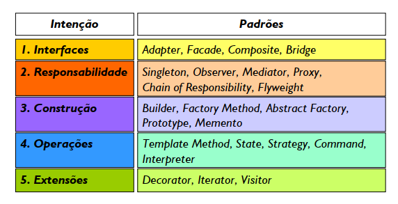

# Padrões Projeto
Este é um Desafio de Projeto do BootCamp Java AI Powered da DIO Explorando Padrões de Projetos na Prática com Java

Os padrões de design podem acelerar o processo de desenvolvimento, fornecendo paradigmas de desenvolvimento testados e comprovados. Um design de software eficaz requer considerar problemas que podem não se tornar visíveis até mais tarde na implementação. A reutilização de padrões de design ajuda a evitar problemas sutis que podem causar grandes problemas e melhora a legibilidade do código para codificadores e arquitetos familiarizados com os padrões.

Muitas vezes, as pessoas só entendem como aplicar certas técnicas de design de software a determinados problemas. Essas técnicas são difíceis de aplicar a uma gama mais ampla de problemas. Os padrões de design fornecem soluções gerais, documentadas em um formato que não requer especificidades vinculadas a um problema específico.

Além disso, os padrões permitem que os desenvolvedores se comuniquem usando nomes conhecidos e bem compreendidos para interações de software. Padrões de design comuns podem ser melhorados ao longo do tempo, tornando-os mais robustos do que projetos ad-hoc.
São soluções consolidadas para problemas recorrentes no desenvolvimento e manutenção de software orientado a objetos.
O livro Design Patterns: Elements of Reusable Object-Oriented Software (1995) é a principal referência sobre o tema, a qual tornou os autores Gamma, Helm, Johnson e Vlissides conhecidos como “Gang of Four” (GoF).

São comumente classificados nas seguintes categorias:
### Padrões Criacionais: 
- Abstract Factory, Builder, Factory Method, Prototype, Singleton.
### Padrões Comportamentais: 
- Chain of Responsibility, Iterator, Observer, Strategy, Template Method.
### Padrões Estruturais: 
- Adapter, Bridge, Composite, Decorator, Facade, Flyweight, Proxy.

