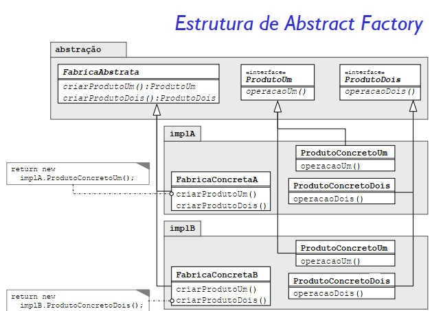
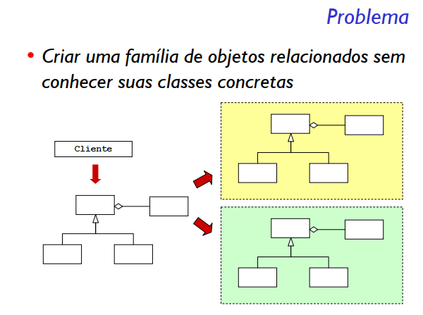
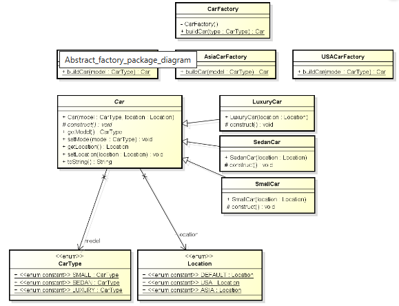

# Padrão Abstract Factory

### Estrutura

A Fábrica Abstrata define um Método de Fábrica por produto. Cada Método de Fábrica encapsula o operador e as classes de produtos concretas, específicas da plataforma. Cada "plataforma" é então modelada com uma classe derivada de Factory.

### Intenção

- Fornecer uma interface para criar famílias de objetos relacionados ou dependentes sem especificar suas classes concretas.
  Uma hierarquia que engloba: muitas "plataformas" possíveis e a construção de um conjunto de "produtos".
  A operadora considerou prejudicial.

### Problema

Para que um aplicativo seja portátil, ele precisa encapsular dependências de plataforma. Essas "plataformas" pode incluir: sistema de janelas, sistema operacional, banco de dados, etc. Muitas vezes, esse encapsulamento não é projetado com antecedência, e muitas declarações de caso com opções para todas as plataformas atualmente suportadas começar para procriar como coelhos em todo o código.

### Solução

Fornecer um nível de indireção que abstrai a criação de famílias de objetos aparentados ou dependentes sem especificando suas classes concretas. O objeto "factory" tem a responsabilidade pela prestação de serviços de criação para o toda a família de plataformas. Os clientes nunca criam objetos de plataforma diretamente, eles pedem à fábrica que faça isso por eles.

Esse mecanismo facilita a troca de famílias de produtos porque A classe específica do objeto de fábrica aparece apenas uma vez em o aplicativo - onde ele é instanciado. O aplicativo pode substituir por atacado toda a família de produtos simplesmente por instanciando uma instância concreta diferente do abstrato fábrica.

Porque o serviço fornecido pelo objeto de fábrica é assim pervasivo, é rotineiramente implementado como um Singleton

