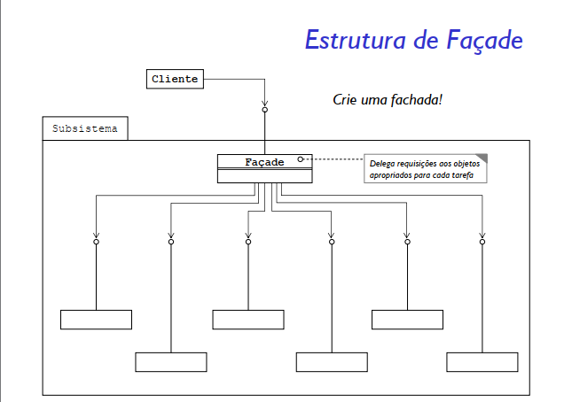
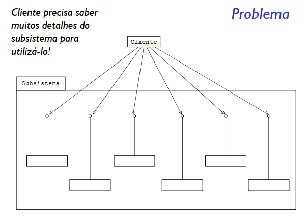
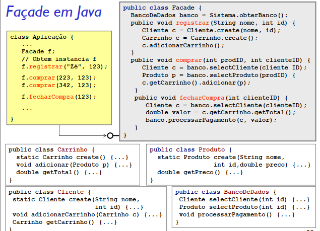

# Padrão Façade

### Intenção
Fornecer uma interface unificada para um conjunto de interfaces em um subsistema. O Facade define uma interface de nível superior que facilita o subsistema para usar.
Envolva um subsistema complicado com uma interface mais simples.

### Problema
Um segmento da comunidade de clientes precisa de uma interface simplificada para o funcionalidade geral de um subsistema complexo.

### Solução
Façade discute o encapsulamento de um subsistema complexo em um único objeto de interface. Isso reduz a curva de aprendizado necessária para alavancar com sucesso o subsistema. Também promove a dissociação do subsistema de seus clientes potencialmente muitos. Por outro lado, se o Fachada é o único ponto de acesso para o subsistema, ele limitará o recursos e flexibilidade que os "usuários avançados" podem precisar.

O objeto Fachada deve ser um simples defensor ou facilitador. Ela não deve se tornar um oráculo onisciente ou objeto "deus".

